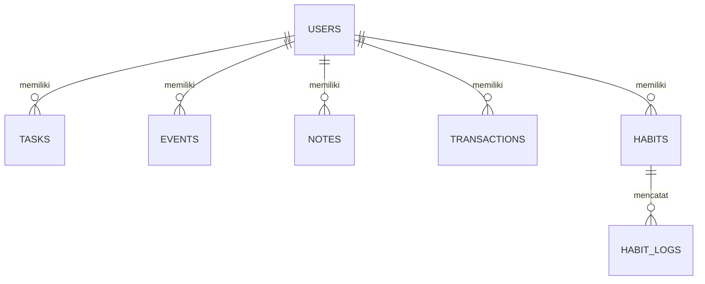

## 1. Desain Arsitektur
Arsitektur aplikasi ini menggunakan model Client-Serverless di mana frontend React berinteraksi langsung dengan Firebase Services.

```mermaid
graph TD
    "A[Frontend: React + Vite]" --> "B[Firebase Auth]"
    "A" --> "C[Firestore Database]"
    "A" --> "D[Firebase Hosting]"
    "A" --> "E[External APIs: Weather & News]"
```

## 2. Deskripsi Teknologi
- **Frontend**: React@18 + tailwindcss@3 + vite
- **Manajemen State**: Zustand (untuk state aplikasi yang ringan)
- **Ikon**: Lucide React
- **Animasi**: Framer Motion
- **Visualisasi Data**: Recharts
- **Backend**: Firebase (Auth & Firestore)
- **Alat Inisialisasi**: vite-init

## 3. Definisi Rute
| Rute | Tujuan |
|-------|---------|
| /login | Halaman masuk pengguna |
| /register | Halaman pendaftaran pengguna baru |
| /dashboard | Halaman utama dashboard dengan ringkasan |
| /tasks | Manajemen daftar tugas |
| /calendar | Kalender dan jadwal acara |
| /notes | Aplikasi catatan dan memo |
| /budget | Pelacakan keuangan dan anggaran |
| /habits | Pelacakan kebiasaan harian |

## 4. Model Data
### 4.1 Definisi Model Data
Berikut adalah struktur koleksi di Firestore.



### 4.2 Struktur Koleksi Firestore
- **users**: { email, displayName, photoURL, preferences }
- **tasks**: { title, description, dueDate, priority, completed, userId }
- **events**: { title, date, startTime, endTime, location, userId }
- **notes**: { title, content, tags, color, userId }
- **transactions**: { type, amount, category, description, date, userId }
- **habits**: { name, frequency, target, color, userId }
- **habit_logs**: { habitId, date, completed, userId }
